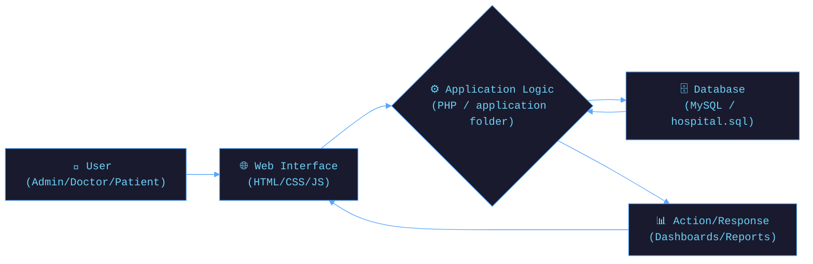

<!-- ═══════════ ANIMATED HEADER ═══════════ -->

# 🏥 Hospital Management System

<div align="center">
<!-- ═══════════ TYPING ANIMATION ═══════════ -->

<br/>

<!-- ═══════════ BADGES ═══════════ -->

&nbsp;

&nbsp;

&nbsp;

&nbsp;


<br/>


&nbsp;

&nbsp;

&nbsp;

&nbsp;


</div>

---

## 🌊 What is Hospital Management System?

**Hospital Management System** is a robust and scalable web application built with PHP and MySQL, designed to automate and streamline the day-to-day operations of a hospital. It provides dedicated modules for administrators, doctors, nurses, and patients, ensuring smooth workflows and efficient healthcare management.

Whether you're managing appointments, handling patient records, or overseeing hospital staff — this system has you covered.

> *"Streamline Healthcare. Manage Efficiently. — The digital backbone of modern hospitals."*

### ✨ Core Philosophy
- 🎯 **Efficiency first** — intuitive dashboards tailored for different roles
- ⚡ **Reliability** — robust data management with secure access controls
- 🔌 **Extensibility** — easily customizable for different healthcare environments

---

## 🚀 Features

<div align="center">

| Feature | Description | Status |
|---------|-------------|--------|
| 👨‍💼 **Admin Module** | Manage departments, staff, users, accounts, and reports | ✅ Active |
| 🧑‍⚕️ **Doctor Module** | Manage patient records, appointments, and prescriptions | ✅ Active |
| 🩺 **Nurse Module** | Handle patient accounts and personal profile management | ✅ Active |
| 🤒 **Patient Module** | View appointments, doctor lists, and personal prescriptions | ✅ Active |
| 📊 **Dashboard Interface** | Beautiful and clean UI for monitoring hospital activities | ✅ Active |
| 🔒 **Role-Based Access** | Secure login system tailored for specific user roles | ✅ Active |

</div>

---

## 🛠️ Tech Stack

<div align="center">

### 🧠 Backend & Database


### 🌐 Frontend


### 🔧 Tools & DevOps


</div>

---

## 🗂️ Project Structure

```
📦 Hospital-Management-System/
├── 📁 application/        ← Application logic (Controllers, Models, Views)
├── 📁 system/             ← Core framework files
├── 📁 css/ & js/          ← Frontend styling and scripts
├── 📁 images/ & uploads/  ← Media and uploaded assets
├── 📄 index.php           ← Main entry point
└── 📄 hospital.sql        ← Database schema
```

---

## ⚙️ Architecture Overview



---

## 🚦 Quick Start

### Prerequisites

```bash
# Make sure you have a local server environment installed (like XAMPP, WAMP, or MAMP)
# PHP Version: 7.x or higher recommended
# MySQL Server
```

### 🖥️ Installation Setup

```bash
# 1. Clone the repository into your server's root directory (e.g., htdocs for XAMPP)
git clone https://github.com/Umangpandey75/Hospital-Management-System.git

# 2. Start Apache and MySQL services in your local server control panel.

# 3. Create a new database in phpMyAdmin named `hospital` (or your preferred name).

# 4. Import the provided `hospital.sql` file into your newly created database.

# 5. Open your browser and navigate to the project
http://localhost/Hospital-Management-System
```

---

## 🎮 How to Use

<div align="center">

```
  Step 1             Step 2              Step 3              Step 4
     🌐                 🔐                  📊                  📋
Open Browser  →  Select User Role  →  Login to Dash  →  Manage Hospital
```

</div>

### 👥 User Modules Breakdown

| Role | Key Capabilities |
|------|------------------|
| **Admin** | Full system oversight, manage all users, departments, transactions & reports |
| **Doctor** | Manage patient profiles, update prescriptions, and handle appointments |
| **Nurse** | Assist in managing patient accounts and updates |
| **Patient** | View doctor availability, book appointments, check prescriptions |

---

## 📸 Interface Preview

<div align="center">

📸 <b>Explore More Screenshots</b><br>
<a href="https://drive.google.com/open?id=1MzCn77LxilevsqaCCaRMESF63wTxnLPr">
View Complete Gallery →
</a>

</div>
---

## 🤝 Contributing

Contributions are what make the open-source community amazing! Here's how you can help:

```bash
# 1. Fork the repository on GitHub
# 2. Create your feature branch
git checkout -b feature/AmazingFeature

# 3. Commit your changes
git commit -m '✨ Add AmazingFeature'

# 4. Push to the branch
git push origin feature/AmazingFeature

# 5. Open a Pull Request 🎉
```

### 💡 Ideas for Contribution
- [ ] 📱 Implement a fully responsive mobile-first UI
- [ ] 💳 Add payment gateway integration for transactions
- [ ] 📧 Implement email/SMS notifications for appointments
- [ ] 📈 Enhance data visualization with interactive charts
- [ ] 🔐 Upgrade authentication to support OAuth or Two-Factor Auth

---

## 📜 License

Distributed under the **MIT License**. See `license.txt` for more information.

---

## 👨‍💻 Author

<div align="center">

### **Umang Pandey**
*Python Developer · Data Analyst · ML Engineer*

[](mailto:umangpandey.co@gmail.com)
&nbsp;
[](https://linkedin.com/in/umang-pandey-01b486273)
&nbsp;
[](https://github.com/Umangpandey75)
&nbsp;
[](https://umangpandey.vercel.app)

*"Query the data. Build the insight. Ship the WOW. ✨"*

</div>

---

## ⭐ Show Your Support

If the **Hospital Management System** helped you, please give it a ⭐ — it means the world!

<div align="center">

[](https://github.com/Umangpandey75/Hospital-Management-System/stargazers)
&nbsp;
[](https://github.com/Umangpandey75/Hospital-Management-System/fork)
&nbsp;
[](https://twitter.com/intent/tweet?text=Check+out+the+Hospital+Management+System+by+%40Umangpandey75!+%F0%9F%8F%A5%F0%9F%92%BB&url=https://github.com/Umangpandey75/Hospital-Management-System)

</div>
---
<!-- ═══════════ FOOTER WAVE ═══════════ -->


<div align="center">

*Made with ❤️ by [Umang Pandey](https://github.com/Umangpandey75) · © 2026 Hospital Management System*


</div>
